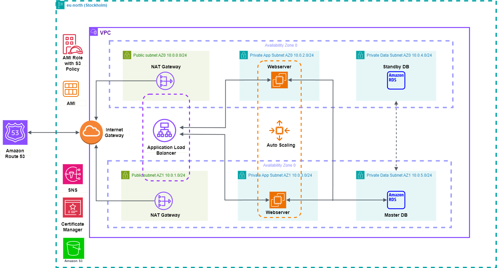

# Terraform with AWS ECS

## Infrastructure Diagram



## Rentzone source code

https://drive.google.com/drive/folders/1-T8tZn7tIYZ6sisFuoihjTlQTvh1iVQP?usp=sharing

## Terraform Variables

Make sure to fill in the values for each variable in your `terraform.tfvars` file.

```hcl
# Environment variables
region=""
project_name=""
environment=""

# VPC variables
vpc_cidr=""
public_subnet_az1_cidr=""
public_subnet_az2_cidr=""
private_app_subnet_az1_cidr=""
private_app_subnet_az2_cidr=""
private_data_subnet_az1_cidr=""
private_data_subnet_az2_cidr=""

# Security-group variables
ssh_from_ip=""

# RDS variables
database_snapshot_identifier=""
database_instance_class=""
database_instance_identifier=""
multi_az_deployment=""

# ACM variables
domain_name=""
alternative_names=""

# S3 variables
env_file_bucket_name=""
env_file_name=""

# ECS variables
architecture =""
container_image = ""

# Route 53 variables
record_name = ""

```

## Variables for RDS(MySQL)

```
PERSONAL_ACCESS_TOKEN=
GITHUB_USERNAME=
REPOSITORY NAME=
WEB_FILE_ZIP=rentzone.zip
WEB_FILE_UNZIP=rentzone
DOMAIN NAME=
RDS_ENDPOINT=
RDS_OB_NAME=
RDS_MASTER_USERNAME=
RDS_OB_PASSWORD=
```
